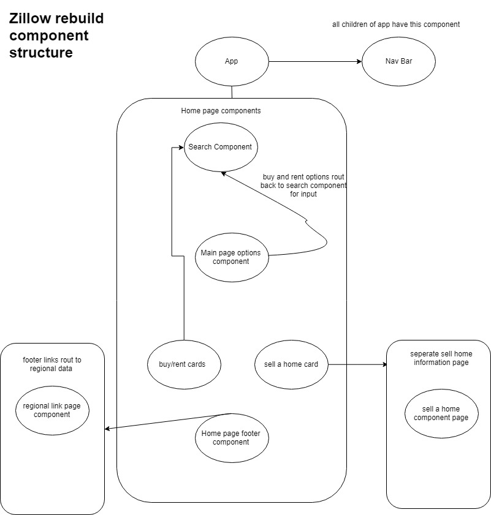

# _Zillow React Clone_

#### By _**David Monarrez**_

## Description

<!-- include thoughts on the difference in development process in angular and react -->

_This project is a clone of the Zillow website created in React after the site was previously cloned in Angluar. This is practice for React fundimentals and does not include the use of state_

_styling in react is probably the biggest difference that I am dealing with in the change from angular to react. It is odd not using a traditional stylesheet but it is nice to have everything associated with a single component to be located in a single jsx file_

_I find my self having to break things up into much smaller components than I did in angular. for example i have broken down the search bar component to its simplest from so that I can reuse it at different times in other components_

_Realizing that as I continue to build out the clone that my component tree may need to be edited to incorperate more components that I have ended up needing to make_

## Component structure

## Notes

 _Had more issues than expected getting the background image to load. finding that I am having to do a little more finagling than before to get the propper styles but likly due to not being quite used to it yet_
 
 _Unforseen (though not totally unexpected) issues trying to get bootstrap to play nicely with react._

## Setup/Installation Requirements

* _Run `git clone https://github.com/Lilkgb/react-template` in your terminal of choice_
* _Navigate to where you put the folder inside your terminal and run `npm install`_
* _After the install is complete you can run `npm run start` to see a live version of the website._

## Known Bugs

_If you run `npm run lint` on pc you will get `Expected linebreaks to be 'LF' but found 'CRLF'`. It doesn't break the code and will still run correctly when you run `npm run start`_

## Support and contact details

_Please contact Ryan McLean at rmcleandev@gmail.com_

## Technologies Used

_scss_
_Webpack_
_React_
_eslint_
_AOS_

### License

*This Software is Licensed under the MIT License.*

Copyright (c) 2019 **_Ryan McLean_**
